  

## 📌 About Me
- 💻 Full-Stack Software Developer
- 🚀 Building scalable web applications and digital products
- 🌱 Currently learning Artificial Intelligence & Machine Learning
- 🧠 Passionate about Software Engineering and System Design
- 📈 Interested in SaaS, Product Development, and Entrepreneurship
- 🤝 Open to collaborating on innovative software projects
- 🔧 Experienced with MERN Stack, Next.js, and modern web technologies
- 🌍 Enthusiastic about Open Source and continuous learning

## 🧠 My Focus Areas
- Full-Stack Web Development
- MERN Stack Development
- Next.js & React Ecosystem
- Artificial Intelligence & Machine Learning
- Software Architecture & System Design
- API Development & Integration
- Cloud Computing & DevOps
- SaaS Product Development
- Open Source Contribution
- Technology Entrepreneurship

## 📊 GitHub Stats & Trophies

  
  

  

  

  

## 🛠️ Languages & Tools

<h3 align="center">Programming Languages</h3>

  &nbsp;&nbsp;
  &nbsp;&nbsp;
  &nbsp;&nbsp;
  &nbsp;&nbsp;
  

<h3 align="center">Frontend</h3>

  &nbsp;&nbsp;
  &nbsp;&nbsp;
  &nbsp;&nbsp;
  &nbsp;&nbsp;
  &nbsp;&nbsp;
  

<h3 align="center">Backend</h3>

  &nbsp;&nbsp;
  &nbsp;&nbsp;
  

<h3 align="center">Database</h3>

  &nbsp;&nbsp;
  &nbsp;&nbsp;
  &nbsp;&nbsp;
  &nbsp;&nbsp;
  

<h3 align="center">DevOps & Cloud</h3>

  &nbsp;&nbsp;
  &nbsp;&nbsp;
  &nbsp;&nbsp;
  

<h3 align="center">Tools</h3>

  &nbsp;&nbsp;
  &nbsp;&nbsp;
  &nbsp;&nbsp;
  &nbsp;&nbsp;
  &nbsp;&nbsp;
  

  

 

## 🔗 Connect with Me

  &nbsp;&nbsp;
  &nbsp;&nbsp;
  &nbsp;&nbsp;
  &nbsp;&nbsp;
  

  

  

